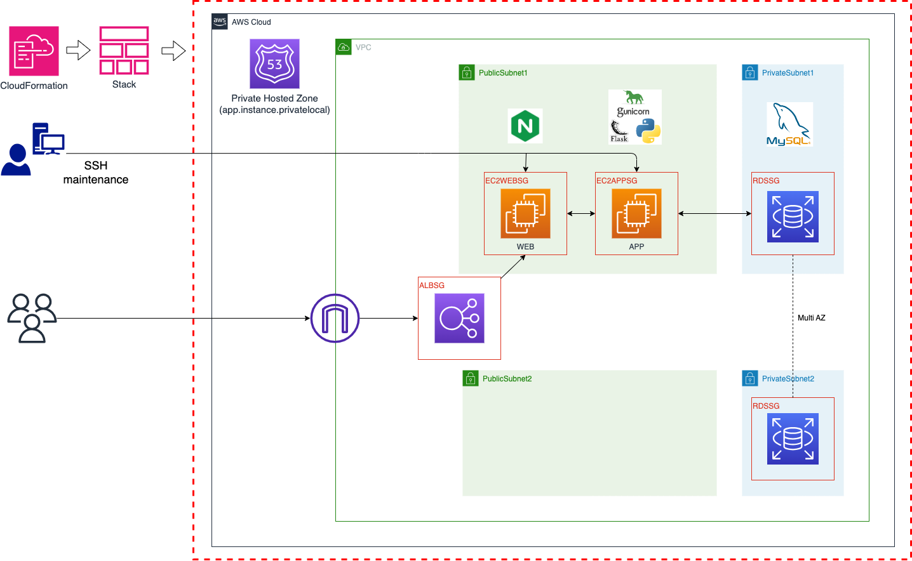
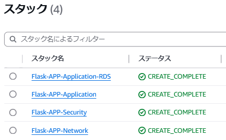
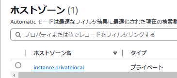
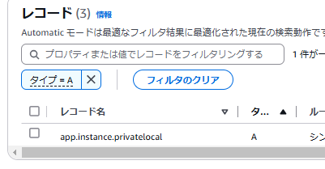
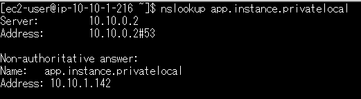
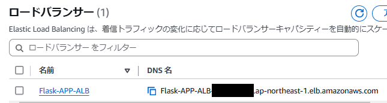
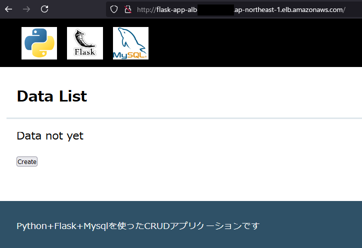

# Flaskアプリ手動構築

## 概要

本構成は、AWS上にFlaskアプリケーションを動作させるインフラを、CloudFormationテンプレートを用いて手動で構築する内容となっています。<br>
以下の4つのテンプレートに分割し、段階的に構成を進めていきます。：

1. **Networkスタック**：VPC / Subnet / IGW / RouteTable / HostedZone
2. **Securityスタック**：ALB / EC2 / RDS のセキュリティグループ
3. **Applicationスタック**：Web/App サーバー、ALB、Route53レコード
4. **Application_RDSスタック**：MySQLデータベース

この手順は、次工程「02-Ansible_APP_Deploy」による**構成自動化の前段階**として機能します。

---

## 製作目的

- cloudformation学習の振り返りとアウトプット
- クロススタック参照の活用
- 後続の自動デプロイ手順整理

---

## ディレクトリ構成

```bash
01-APP_Deploy/01-CfnTemplate/
├── Flask-APP_01_Network.yml         # VPC / Subnet / Route / HostedZone
├── Flask-APP_02_Security.yml        # セキュリティグループ
├── Flask-APP_03_Application.yml     # EC2 / ALB / Route53レコード
└── Flask-APP_04_Application_RDS.yml # RDS
```

---

## インフラ構成図



---

## CloudFormation構成テンプレートと主な役割

### 1. Flask-APP_01_Network.yml

[Networkスタック](01-APP_Deploy/01-CfnTemplate/Flask-APP_01_Network.yml)<br>

- VPCとサブネット（Public/Private）を構成
- IGW / RouteTable / HostedZone（Private）
- RDS用のSubnetGroupもこのテンプレートで定義

| 項目 | 説明 |
|------|------|
| VPC | 10.10.0.0/16 のCIDRブロック |
| Public Subnet（2AZ） | Appサーバー/ Webサーバー/ALB用（1a,1c） |
| Private Subnet（2AZ） | RDS用（1a,1c） |
| IGW / RouteTable | インターネット通信用設定 |
| HostedZone | `privatelocal` ドメイン向けPrivateゾーン |

### 2. Flask-APP_02_Security.yml

[Securityスタック](01-APP_Deploy/01-Figure/Flask-APP_02_Security.yml) <br>

- ALB / Web / App / RDS 用のセキュリティグループを定義
- IP制限付きのインバウンドルール（HTTP, SSH など）

| SG名 | 説明 | ポート |
|------|------|------|
| ALB-SG | 外部からのHTTPアクセス | 80 |
| Web-SG | ALBからのトラフィック許可<br> SSH許可 | 80 <br> 22|
| App-SG | Webサーバーからの通信許可<br> Flask起動確認許可<br> SSH許可 | 8000 <br> 5000 <br> 22 |
| RDS-SG | AppサーバーからのMySQL通信許可 | 3306 |

### 3. Flask-APP_03_Application.yml

[Applicationスタック](01-APP_Deploy/01-Figure/Flask-APP_03_Application.yml)<br>

- Web用とApp用の2つのEC2インスタンスを作成
- Amazon Linux AMI の選択（固定AMI or 最新）に対応
- ALB + TargetGroup + Listener の作成
- app.instance.privatelocal に対する Route53レコード登録

| リソース | 説明 |
|----------|------|
| EC2（Websv） | PublicSubnet、ALB経由でアクセス |
| EC2（Appsv） | Websvから接続 |
| ALB | Websvをターゲットとしてリスニング（HTTP） |
| Route53 Record | `app.instance.privatelocal` のAレコード作成（Appsv） |

### 4. Flask-APP_04_Application_RDS.yml

[Application_RDSスタック](01-APP_Deploy/01-Figure/Flask-APP_04_Application_RDS.yml)<br>

- MySQL 8.0 を Multi-AZで起動
- SecretsManager などは使わず、テンプレートで直接定義（学習目的の簡易構成）

| リソース | 説明 |
|----------|------|
| RDS（MySQL8.0） | Multi-AZ構成（1a,1c） |

> cfn-lint（コードを精査して、そのコードを実行したときにエラーを発生させる可能性のある構文エラーやバグがないかを探すプログラム）を実施すると`W1011 Use dynamic references over parameters for secrets`が出力されるが、AWSコンソールからの手動スタックにて値を入力することを前提としているため、対処せず。


### セキュリティと構成に関する補足

- 各セキュリティグループで通信経路を分離
- パスワードはスタック作成時直書き
- SSHやALBアクセスは固定グローバルIPに制限
- Route53はPrivate Hosted Zoneにより内部解決を実現（Websp → Appsv の名前解決用）

---

## 手動構築手順（AWSマネジメントコンソール）

1. **AWSマネジメントコンソールにログイン**
2. **CloudFormation > スタックの作成** を開く
3. 各テンプレート（Flask-APP_01 ～ 04）を **順番にアップロード**
4. パラメータを入力し「スタックの作成」実行

### スタック別パラメータ例

#### Flask-APP_01_Network.yml

| パラメータ名 | 値 |
|--------------|----|
| EnvironmentName | Flask-APP-Product |
| VPCRegion | ap-northeast-1 |
| VpcCIDR | 10.10.0.0/16 |
| PublicSubnet1CIDR | 10.10.1.0/24 |
| PublicSubnet2CIDR | 10.10.2.0/24 |
| PrivateSubnet1CIDR | 10.10.11.0/24 |
| PrivateSubnet2CIDR | 10.10.12.0/24 |

#### Flask-APP_02_Security.yml

| パラメータ名 | 値 |
|--------------|----|
| EnvironmentName | Flask-APP-Product |
| ALBAccessFrom | `xxx.xxx.xxx.xxx/32`（固定IP） |
| SSHAccessFrom | `xxx.xxx.xxx.xxx/32`（固定IP） |

#### Flask-APP_03_Application.yml

| パラメータ名 | 値 |
|--------------|----|
| EnvironmentName | Flask-APP-Product |
| EC2Keypair | 任意のキーペア名 |
| UseEC2APPLatest / UseEC2WEBLatest | false |
| AppServerAmiId / WebServerAmiId | 任意のAMI（AmazonLinux2など） |

#### Flask-APP_04_Application_RDS.yml

| パラメータ名 | 値 |
|--------------|----|
| EnvironmentName | Flask-APP-Product |
| RDSDBUserName | （DBユーザ名） |
| RDSDBUserPass | （DBパスワード） |
| RDSDataBaseName | （DB名） |

> `Outputs` を活用し、後続テンプレート間の依存関係も管理しています。

---

## スタック結果確認

- 各CloudFormationスタックが「CREATE_COMPLETE」であること
- `app.instance.privatelocal` の名前解決が成功すること

---

### 各CloudFormationスタックが「CREATE_COMPLETE」

  <br>

---

### HostZoneおよびArecordsetのリソース確認

スタック作成後にホストゾーンとレコードセットが作成されていること、また、EC2WEBから名前解決できることを確認<br>
  <br>
  <br>
  <br>

---

### CFnにて作成されたALB DNS名を確認

  <br>

---

## AWS環境へのアプリケーション手動デプロイ

本構成では Ansible や自動化ツールを使用していないため、**EC2インスタンスへ手動ログインしアプリケーションをセットアップ** します。 <br>
> 次工程である「02_Ansible_APP_Deploy」では当手順を自動化します。

### ① Appサーバ構築手順（appsv）

```bash
# 1. 必要パッケージのインストール
sudo dnf update -y
sudo dnf install -y git gcc zlib-devel bzip2-devel readline-devel sqlite sqlite-devel openssl-devel tk-devel libffi-devel xz-devel

# 2. pyenvのインストール
git clone https://github.com/pyenv/pyenv.git .pyenv
echo 'export PATH="$HOME/.pyenv/bin:$PATH"' >> ~/.bashrc
echo 'eval "$(pyenv init -)"' >> ~/.bashrc
source ~/.bashrc

# 3. Pythonのインストールと環境切り替えおよびPoetryのインストール
pyenv install 3.12.1
pyenv global 3.12.1
curl -sSL https://install.python-poetry.org | python3 - --version 1.8.4

# 4. アプリケーションのcloneとインストール
git clone https://github.com/tomi050403/flask-app.git
cd flask-app
nano flaskr/.env
```

> サンプルアプリケーション用の.envファイル作成（.envについてはサンプルアプリケーションリポジトリ参照）<br>
> [自作サンプルアプリケーション](https://github.com/tomi050403/flask-app.git)<br>

```bash
export FLASK_APP=flaskr
poetry install
poetry shell
flask run -h 0.0.0.0
```

Flask接続確認  <br>
CFnにて作成したAppServerのパブリックIPを確認。

  <br>

EC2Appにブラウザ接続し、起動出来ていることを確認

  <br>

```bash
# appサーバとwebサーバを分離する
# flask run を停止後
# 5. Gunicorn起動
poetry add gunicorn
poetry run gunicorn flaskr:app -b 0.0.0.0:8000
```

---

### ② Webサーバ構築手順（websv）

```bash
# 1. nginxのインストールと設定
sudo dnf -y install nginx

# 2. Flaskアプリ向けnginx設定ファイルの配置
sudo nano /etc/nginx/conf.d/flask-app.conf
```

下記のように作成。

```nginx
server {
    listen 80;
    server_name app.instance.privatelocal;

    location / {
        proxy_pass http://app.instance.privatelocal:8000;
        proxy_http_version 1.1;
        proxy_set_header Host $host;
    }
}
```

```bash
# 3. nginx起動
sudo systemctl start nginx.service
# 4. nginx起動設定
sudo systemctl enable nginx.service
```

---

## アプリケーション接続確認

- ALB のDNSにアクセスしてFlaskアプリが表示されること

---

### ブラウザ接続し、ALB経由で起動出来ていることを確認

  <br>
