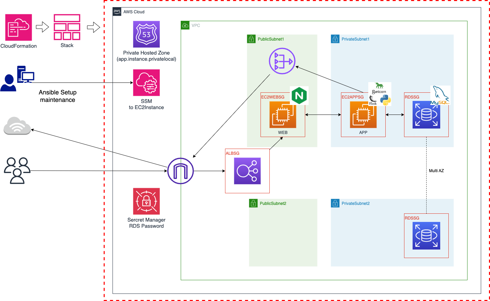

# WebアプリケーションのAnsibleデプロイ
- 自作したCRUDアプリケーションをAWS環境にAnsibleにてデプロイする。

# 手動デプロイとの主な変更点
- Ansibleでコントロールノード（自宅ローカル端末）からターゲットノード（AWS EC2インスタンス）にPlaybookを実行する際、通常ssh接続を利用するが、SSMを経由してPlaybookを実行する形とする。
- APP-SVについて、プライベートサブネットに移行。
- RDSについて、パスワード管理をsecret managerを利用する。

# AWS環境構築
変更点を踏まえた、今回実施の構成図は下記のとおり
## 構成図
   

# CFnテンプレート
## 1,Network

[Networkスタック](02-Ansible_APP_Deploy/02-CfnTemplate/Flask-APP_01_Network.yml) 

|主な変更点||備考|
| :--- | :--- | :--- |
|NATGateway|追加|プライベートサブネットに配置変更したAPP-SVのインターネット接続のため|

## 2,Security

[Securityスタック](02-Ansible_APP_Deploy/02-CfnTemplate/Flask-APP_02_Security.yml)   

|主な変更点||備考|
| :--- | :--- | :--- |
|IAMRole|追加|EC2にSSM接続するため|
|Secret Manager|追加|RDS設定情報管理のため|
|SG(各EC2) ssh許可設定|削除|SSM利用に伴い許可設定が不要になったため|
|SG(APP) 5000ポート許可設定|削除|完成版について5000ポートを利用しないため|

## 3,Application

[Applicationスタック](02-Ansible_APP_Deploy/02-CfnTemplate/Flask-APP_03_Application.yml) 

|主な変更点||備考|
| :--- | :--- | :--- |
|各EC2インスタンス IamInstanceProfile|追加|EC2へのSSM接続のため|
|Prameters EC2APPのInstanceType選択|追加|テストデプロイ時にリソース不足を示唆するエラーが発生したため選択式に変更 デフォルト:t2.small|

## 4,Application(RDS)

[Application_RDSスタック](02-Ansible_APP_Deploy/02-CfnTemplate/Flask-APP_04_Application_RDS.yml) 
RDSのみスタック実行時間を要するため分離。 

|主な変更点||備考|
| :--- | :--- | :--- |
|RDS Username,UserPassword|変更|Parametersを削除し、Secret Manager利用設定の追加|

# Ansibleアプリケーションデプロイ

[手動デプロイ](https://github.com/tomi050403/AWS_Portfolio/blob/main/01-APP_Deploy.md#%E3%82%A2%E3%83%97%E3%83%AA%E3%82%B1%E3%83%BC%E3%82%B7%E3%83%A7%E3%83%B3%E3%83%87%E3%83%97%E3%83%AD%E3%82%A4)にて実施した内容について、ansibleのplaybookを作成。 

## 準備
### コントロールノード（Ansible実行環境構築）

|||
| :--- | :--- |
|OS| Amazon Linux 2 (Kernel 4.14.355)|
|仮想化環境| Hyper-V (自宅サーバ)|
|Ansible| v2.18.1|
|Python|3.12 (pyenv + Poetry)|

### ターゲットノード（EC2インスタンス）への接続設定
通常ansibleにてターゲットノードへssh接続するため、公開IPやSGの許可設定などが必要になるが、ssm経由で実行可能な方法があったため、ssm経由でplaybookを実行する構成とする。

[hosts.ini](02-Ansible_APP_Deploy/02_ansible/inventoryes/hosts.ini) 

上記箇所に下記のようにhosts.iniファイルを作成

~~~
[app_targetnode]
EC2AppInstance ansible_host=<APPインスタンスID>

[web_targetnode]
EC2WebInstance ansible_host=<WEBインスタンスID>

[all:vars]
ansible_user='ec2-user'
ansible_become=true
ansible_ssh_private_key_file=<プロジェクト用keyfileパス>
ansible_python_interpreter=/usr/bin/python3.9
ansible_ssh_common_args=-o StrictHostKeyChecking=no -o ProxyCommand="sh -c \"aws ssm start-session --target %h --document-name AWS-StartSSHSession --parameters 'portNumber=%p'\""
~~~

## デプロイ
### roles
[手動デプロイ](01-APP_Deploy.md)にて実施した内容を下記のようにroles定義 

|roles|手動デプロイ項番|対象|
| :--- | :--- | :--- |
|APP_01_Initial|01_Initial|APP|
|APP_02_Pyenv_Install|02 pyenv-install|APP|
|APP_03_Python_install|03_Python-install|APP|
|APP_04_Application_install_setup|04_Application-install|APP|
|APP_05_Setup_Gunicorn|05_Application-setup|APP|
|WEB_01_Initial|01 set-up-websv|WEB|

### vars
[vars.yml](vars/vars.yml) 
roles内で使用するユーザ名やファイルパス、アプリケーションバージョンなどの定義ファイル 
[sec.yml](vars/sec.yml) 
roles内で使用するDB情報など秘匿したい情報を定義したファイル 
ansible-vault encrypt [ファイル名]コマンドにて暗号化している。 

### 実行
setup.ymlに上記内容のplaybookを記載し、下記コマンドで実行する。 

~~~
ansible-playbook -i inventoryes/hosts.ini setup.yml --ask-vault-pass
~~~

## デプロイ後の確認

実行結果

# Gunicorn接続確認

## CFnにて作成されたALB DNS名を確認

   
## ブラウザ接続し、ALB経由で起動出来ていることを確認

   