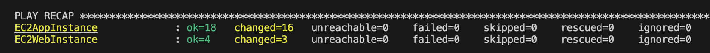
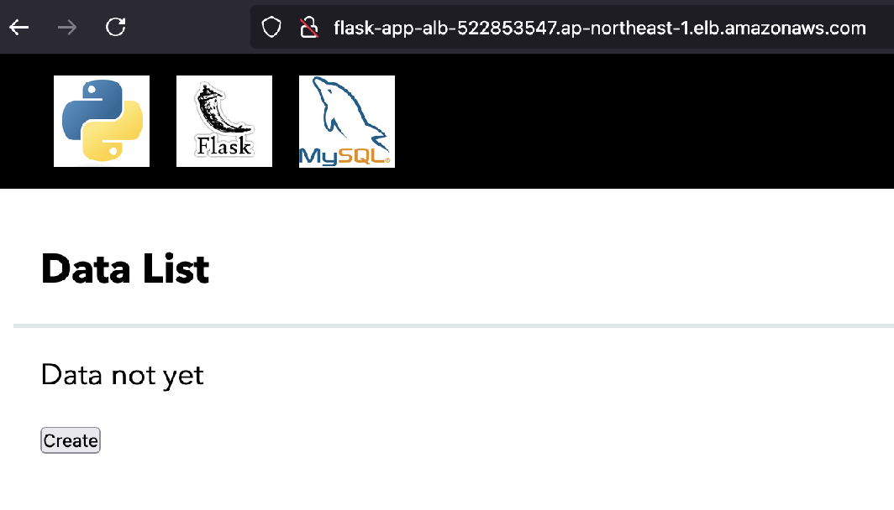

# WebアプリケーションのAnsibleデプロイポートフォリオ

## 概要

前フェーズでCloudFormationにより構築されたWebアプリケーション環境（EC2/ALB/RDSなど）に対して、**Ansibleを用いてアプリケーションの自動構成・デプロイ**を行うものです。

---

## 製作目的

- 手動デプロイ工程をAnsibleで自動化
- Webサーバー（nginx）、Appサーバー（gunicorn + Flask）の構築自動化
- SSMを活用した安全なAnsible接続

---

## ディレクトリ構成

```bash
02_Ansible_APP_Deploy/
├── setup.yml                               # Playbook定義
├── inventoryes
│   └── hosts.ini                           # inventoryファイル
├── roles                                   # roles定義
│   ├── APP_01_Initial/
│   ├── APP_02_Pyenv_Install/
│   ├── APP_03_Python_install/
│   ├── APP_04_Application_install_setup/
│   ├── APP_05_Setup_Gunicorn/
│   └── WEB_01_Set-Up-Websv/
└── vars                                    # 変数定義
    ├── sec.yml
    └── vars.yml
```

---

## CloudFormationテンプレート変更点

- 本Playbookは、01にて構築されたCloudFormation環境上のEC2インスタンスを対象としています。
01の際のものについて以下部分が変更になっています。：
- Ansibleでコントロールノード（自宅ローカル端末）からターゲットノード（AWS EC2インスタンス）にPlaybookを実行する際、SSMを利用する。
- APP-SVについて、プライベートサブネットに移行。
- RDSについて、パスワード管理をsecret managerを利用する。


---

## CFnテンプレート

### 1.Network

[Networkスタック](02-Ansible_APP_Deploy/02-CfnTemplate/Flask-APP_01_Network.yml)<br>

|変更点||備考|
| :--- | :--- | :--- |
|NATGateway|追加|プライベートサブネットに配置変更したAPP-SVのインターネット接続のため|

### 2.Security

[Securityスタック](02-Ansible_APP_Deploy/02-CfnTemplate/Flask-APP_02_Security.yml)  <br>

|変更点||備考|
| :--- | :--- | :--- |
|IAMRole|追加|EC2にSSM接続するため|
|Secret Manager|追加|RDS設定情報管理のため|
|SG(各EC2)<br>ssh許可設定|削除|SSM利用に伴い許可設定が不要になったため|
|SG(APP)<br>5000ポート許可設定|削除|完成版について5000ポートを利用しないため|

### 3.Application

[Applicationスタック](02-Ansible_APP_Deploy/02-CfnTemplate/Flask-APP_03_Application.yml)<br>

|変更点||備考|
| :--- | :--- | :--- |
|各EC2インスタンス<br>IamInstanceProfile|追加|EC2へのSSM接続のため|
|Prameters<br>EC2APPのInstanceType選択|追加|テストデプロイ時にリソース不足を示唆するエラーが発生したため選択式に変更<br>デフォルト:t2.small|

### 4.Application(RDS)

[Application_RDSスタック](02-Ansible_APP_Deploy/02-CfnTemplate/Flask-APP_04_Application_RDS.yml)<br>
RDSのみスタック実行時間を要するため分離。<br>

|変更点||備考|
| :--- | :--- | :--- |
|RDS<br>Username,UserPassword|変更|Parametersを削除し、Secret Manager利用設定の追加|

---

## 構成図

- 変更点を踏まえた、今回実施の構成図は下記のとおり

  <br>

---

## Ansible実行環境

### 利用バージョン例

| ツール     | バージョン例        |
|------------|---------------------|
| Ansible    | v2.18.1        |
| Python     | 3.12.1（pyenv使用） |
| Poetry     | 1.8.4               |

---

## Inventory構成（SSM接続）

通常、AnsibleではSSHによる接続を行いますが、本構成では**SSM（AWS Systems Manager）経由の接続**を採用しています。

`02-Ansible_APP_Deploy/02_ansible/Inventory/hosts.ini`

```ini
[app_targetnode]
EC2AppInstance ansible_host=<APPインスタンスID>

[web_targetnode]
EC2WebInstance ansible_host=<WEBインスタンスID>

[all:vars]
ansible_user='ec2-user'
ansible_become=true
ansible_ssh_private_key_file=<プロジェクト用keyfileパス>
ansible_python_interpreter=/usr/bin/python3.9
ansible_ssh_common_args=-o StrictHostKeyChecking=no -o ProxyCommand="sh -c \"aws ssm start-session --target %h --document-name AWS-StartSSHSession --parameters 'portNumber=%p'\""
```

---

## Playbook構成と処理概要

### Roles
[setup.yml](02-Ansible_APP_Deploy/02-ansible_sourcecode/setup.yml)で定義し、[手動デプロイ](01-APP_Deploy.md)にて実施した内容を用途別に６つ定義しています。

|Role名|対象|概要|
| :--- | :--- | :--- |
|APP_01_Initial|APP|1. 必要パッケージのインストール|
|APP_02_Pyenv_Install|APP|2. pyenvのインストール|
|APP_03_Python_install|APP|3. Pythonのインストールと環境切り替えおよびPoetryのインストール|
|APP_04_Application_install_setup|APP|4. アプリケーションのcloneとインストール|
|APP_05_Setup_Gunicorn|APP|5. Gunicorn起動|
|WEB_01_Initial|WEB|Webサーバ構築手順|

### vars
[vars.yml](02-Ansible_APP_Deploy/02_ansible/vars/vars.yml)<br>
Roles内で使用するユーザ名やファイルパス、アプリケーションバージョンなどを定義したファイルになります。<br>
[sec.yml](02-Ansible_APP_Deploy/02_ansible/vars/sec.yml)<br>
Roles内で使用するDB情報など秘匿したい情報を定義したファイルになります。<br>
`ansible-vault encrypt`コマンドを用いて暗号化しています。<br>

`02-Ansible_APP_Deploy/02_ansible/vars/sec.yml`
```yml
db_host: "<ホスト名>"
db_user: "<DBユーザー>"
db_password: "<DBパスワード>"
```

---

## 実行
下記コマンドで実行するとパスワードを問われるため、`ansible-vault encrypt`で暗号化したパスワードを入力する。<br>

```bash
ansible-playbook -i inventory/hosts.ini setup.yml --ask-vault-pass
```

---

## 実行結果
実行結果が表示され、<br>

  <br>

手動デプロイ時同様に、アプリケーションが起動していることを確認出来た。<br>

