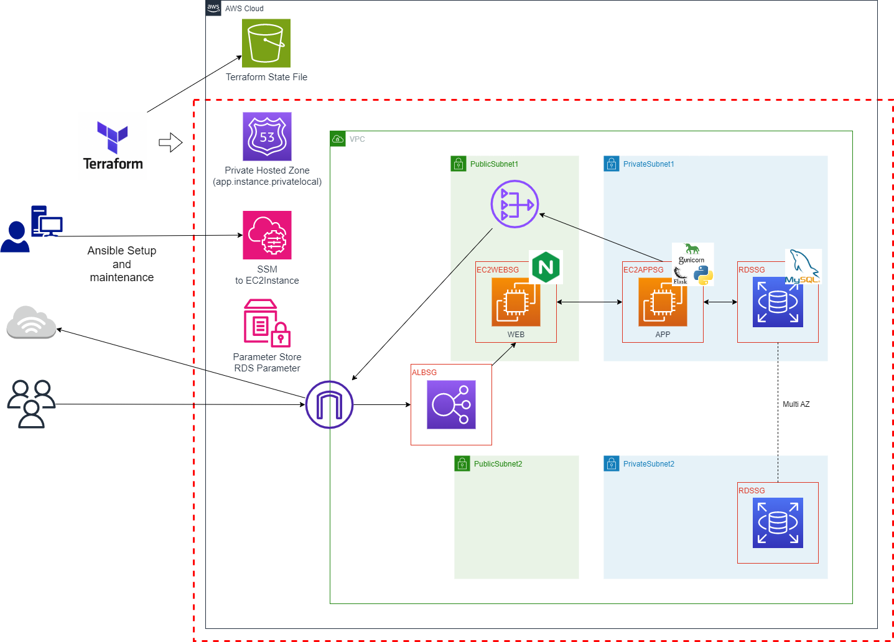

# AWS Flaskアプリケーション環境のTerraform構築

## 概要

前項までcloudformationにて構築していたFlaskアプリケーション実行環境を**Terraform を用いたIaC方式で構築**したものです。<br>
ネットワーク環境、EC2、RDS、ALB、IAM、Route53 など、Webアプリケーションの基本的なインフラ構成を、**再利用可能なモジュール構成と環境分離で実装**しています。

---

## 製作目的

- Terraform学習のアウトプット
- AWS構成設計スキルの実践
- IaCの基盤作成

---

## ディレクトリ構成

`/03-Terraform_Deploy/03-Terraform_sourcecode`
```bash
.
├── environments/          # 環境ごとの設定
│   ├── dev/               # dev環境設定
│   └── prod/              # prod環境
├── modules/               # モジュール群
│   ├── alb/               # ALB
│   ├── compute/           # EC2
│   ├── iam/               # IAMロール
│   ├── network/           # VPC, Subnet
│   ├── rds/               # MySQL
│   ├── route53/           # DNS
│   └── security/          # SG
└── src/                   # EC2接続設定用のキーペアファイルをここに配置する
```

---

## インフラ構成図
  <br>

### 前回（cloudformation）からの変更点

- RDSパスワードについてランダム生成。
- RDSパスワード管理に利用していたsecret managerをSSM Parameter Storeに変更。
- 併せてRDS接続情報についてもSSM Parameter Storeに出力。

---

## Terraform状態管理（.tfstate）について

本プロジェクトでは、**環境（dev/prod）ごとにディレクトリを分けた上で、別途準備したS3バケットをバックエンドとして状態管理**を行っています。

- `environments/dev/backend.tf` に `backend "s3"` の設定を記述
- 各環境は個別に S3 の key 名を持たせています

```hcl
terraform {
  backend "s3" {
    bucket  = "バケット名"
    key     = "flask-app/dev/terraform.tfstate"
    region  = "ap-northeast-1"
    profile = "terraform"
  }
}
```

---

## パラメータ管理（terraform.tfvars）について

構成の再利用性と環境ごとの柔軟性の高さを意識して、変数（variable）の値を別ファイルに定義しました。<br>
本プロジェクトでは、`environments/dev/terraform.tfvars` にて dev 環境向けのパラメータを集中管理しています。<br>
※設定例として`environments/dev/terraform.tfvars.example`をご参照下さい。

例：
```hcl
project     = "flask-app"
environment = "dev"
region      = "ap-northeast-1"

vpc_cidr_block  = "10.10.0.0/16"
AZ_1            = "ap-northeast-1a"
AZ_1_publicsub  = "10.10.1.0/24"
AZ_1_privatesub = "10.10.11.0/24"
AZ_2            = "ap-northeast-1c"
AZ_2_publicsub  = "10.10.2.0/24"
AZ_2_privatesub = "10.10.12.0/24"
```

- `variables.tf` に変数定義（型など）を記述し、再利用可能に。
- `terraform.tfvars` によって環境に応じた値を上書きできる構成です。
- セキュアな変数管理を意識し、パスワードなどは `SSM Parameter Store SecureString` を活用。

---


## 構成モジュール

### モジュール利用との関係
 `modules/` ディレクトリに機能単位でモジュールを定義しており、各環境（例：`environments/dev/main.tf`）では `module` ブロックでこれらを呼び出します。<br>
 各モジュールの出力 (`output`) を `module.xxx.output_name` 形式で他モジュールから参照可能なようにしております。


### ◼ 1. network

- VPC, Subnet, Route Table, IGW, NAT Gateway などを対応

### ◼ 2. security

- ALB/Web/App/RDS のセキュリティグループを個別定義
- 各 SG の ingress/egress を明示的に設定

### ◼ 3. compute

- EC2のロール分離 (web サーバ, app サーバ)
- IAMロールによるSSM管理の対応

### ◼ 4. rds

- MySQL 8.0 / Multi-AZ
- パスワードは `random_string` + `SecureString` で自動発行
- DB 接続情報 を SSM Parameter Store SecureString で登録

### ◼ 5. route53

- Private Hosted Zone　定義
- `app.<env>` として A レコード登録（websv　→　appsvの名前解決用）

---

## 使用技術

| 項目      | 内容                                          |
| ------- | ------------------------------------------- |
| IaC     | Terraform v1.11.2                           |
| クラウド    | AWS (VPC, EC2, RDS, ALB, IAM, SSM, Route53) |
| State管理 | S3 (backend.tf に記述)              |
| 秘匿情報    | SSM Parameter Store + SecureString          |

---

## SSM Parameter Store 登録情報

| 名前                          | 内容       | SecureString |
| --------------------------- | -------- | ------ |
| /flask-app-dev/DB\_HOST     | DB ホスト   | string      |
| /flask-app-dev/DB\_DATABASE | DB 名     | string      |
| /flask-app-dev/DB\_USERNAME | DB ユーザ   | securestring      |
| /flask-app-dev/DB\_USERPASS | DB パスワード | securestring      |


---

## 構築方法

下記ファイルに適切な値を設定し、
- environments/dev/terraform.tfvars
- environments/dev/backend.tf

下記コマンドを実行

```bash
cd environments/dev

terraform init      # 初期化
terraform plan      # ドライラン
terraform apply     # 適用
```

---

## 実行結果（作成中）

### ①terraform実行結果抜粋

下記のように`terraform apply`が成功したことを確認。<br>
<br>

### ②parameter store 出力結果

今回追加したParameter Storeについても作成されていることを確認。<br>
<br>

### ③alb 出力結果

albについても作成されていることを確認。<br>
<br>

### ④ansible実行後のalbブラウザ接続結果

terraformで構築した環境についてansibleでアプリケーションデプロイを行い、下記のようにアプリケーションに接続できることを確認できた。<br>
<br>