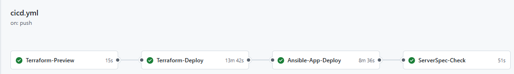
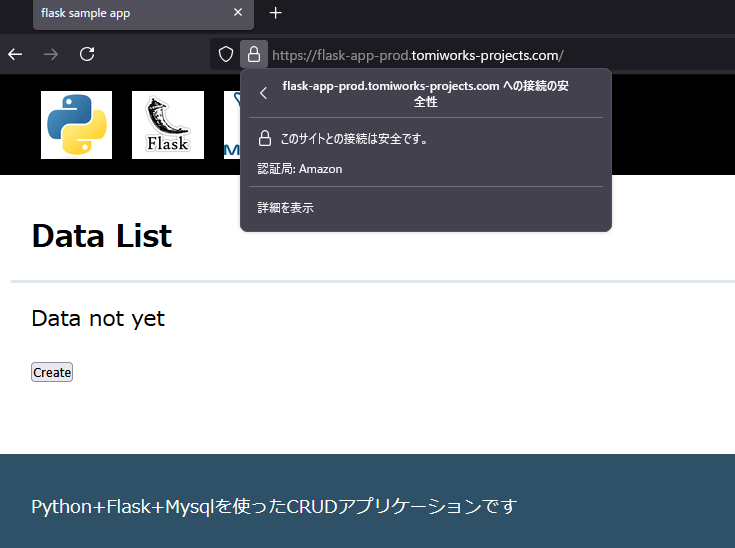

# GitHubActionsによるCICDパイプライン実装

## 概要
GitHub Actionsを用いて、Terraformによるインフラ構築からAnsibleによるアプリ自動デプロイを実施し、さらにServerspecによる検証までを一連のCI/CDパイプラインにて自動化します。

---

## 製作目的
* インフラ構築・アプリデプロイの全工程をコード化し、一貫性と再現性を確保する
* 手動操作の負荷低減とヒューマンエラー防止
* 変更ごとに自動的に環境が検証されることで品質向上を図る

---

## ディレクトリ構成
ワーフクローおよび対象ソースコードについては別リポジトリ([Flask_App_CICD_AWS](https://github.com/tomi050403/Flask_App_CICD_AWS))をご参照ください。  

```
.github/workflows/
└── flask_app_cicd_aws_https.yml  # 本ワークフロー定義
01_terraform/flask-app/           # terraformソースコード
02_ansible/                       # ansibleソースコード
03_serverspec/                    # serverspecソースコード
```

---

## 構成図

  <br>
 
---

## ワークフロー起動条件

|トリガー種別     | 条件                                              |
| :-------------- | :---------------------------------------------- |
|push             |ブランチへの push  |


## 環境変数
| 変数                         | 説明                      |
| --------------------------- | ----------------------- |
| AWS\_REGION                 | 利用リージョン（ap-northeast-1） |
| TF\_VERSION                 | Terraform バージョン         |
| TF\_VAR\_environment        | デプロイ対象環境(dev/prod)      |
| TF\_VAR\_project            | プロジェクト名                 |
| TF\_VAR\_region             | Terraform 変数 region     |
| TF\_VAR\_ALB\_from\_IP      | ALBアクセス元IP              |
| TF\_VAR\_rds\_username      | RDSユーザ名                 |
| TF\_VAR\_public\_host\_zone | Route53 ホストゾーン          |
| ANS\_EXECUTE\_PATH          | Ansible 実行ディレクトリ        |
| SPEC\_EXECUTE\_PATH         | Serverspec 実行ディレクトリ     |
| SPEC\_RUBY\_VERSION         | Ruby バージョン              |

## Actions secrets and variables
### secrets
| 変数                        | 説明                      |
| --------------------------- | ----------------------- |
| AWS_IAM_ROLE_ARN            | AWS credentials 用 |
| BED_01_BACKEND_BUCKET       | Terraform state file 保存先 S3 bucket |
| EC2_PRIVATE_KEY             | ssh key pair |
| RDS_01_RDS_USERNAME         | RDS username |
| SEC_01_ALB_FROM_IP          | ALB接続用SG用許可IP |

### variables
| 変数                         | 説明                      |
| --------------------------- | ----------------------- |
| PUBLIC_HOST_ZONE | Route53 ホストゾーン |

## ジョブ構成と依存関係

| ジョブ名           | 実行条件                                         | 依存関係           |
| :----------------- | ---------------------------------------------- | ------------------ |
| Terraform-Preview  | 常に実行                                        | なし               |
| Terraform-Deploy   | Terraform Plan にて差分がある場合                 | Terraform-Preview  |
| Ansible-App-Deploy | Terraform Apply 実行後のリソース数が既定の数ある場合 | Terraform-Deploy   |
| ServerSpec-Check   | Ansible による構成完了後、常に実行                 | Ansible-App-Deploy |

## 各ジョブの処理概要

### Terraform-Preview
Terraform のセットアップと初期化
- terraform plan を実行し、差分があるかどうかを Exit Code（0: 無変更, 2: 差分あり）で判断
- Exit Code を次ジョブの実施判定として渡すため TF_PLAN_EXITCODE として出力

**steps**:
  1. Checkout リポジトリ
  2. Terraformセットアップ (`hashicorp/setup-terraform@v3`)
  3. AWS認証 (`aws-actions/configure-aws-credentials@v4`)
  4. `terraform init`（backend設定）
  5. `terraform validate`
  6. `terraform plan`（`-detailed-exitcode`、exit code を出力に記録）

### Terraform-Deploy
Terraform applyによるAWS環境構築の実行
- Terraform-Preview の結果 TF_PLAN_EXITCODE == 2 の場合のみ実行
- terraform apply を commit message に [apply] が含まれている場合のみ実行
- Apply 後に terraform state list で状態ファイル中のリソース数をカウントし、TF_STATE_FLAG として出力

**steps**:
  1. Checkout
  2. Terraformセットアップ
  3. AWS認証
  4. `terraform init`
  5. `terraform apply`（コミットメッセージに`[apply]`含む場合）
  6. Terraform state のリスト数取得（TF\_STATE\_FLAG）
  7. 環境変数フラグ取得（TF\_ENVIRONMENT\_FLAG）


### Ansible-App-Deploy
Ansible Playbook によるアプリデプロイ実行
- Terraform-Deploy の TF_STATE_FLAG が規定の数の場合にのみ実行（想定通りにインフラが構成されているとき）
- EC2インスタンスID取得およびSSMパラメータストアからDB情報などを取得し、inventoryファイル、varsファイルを更新

* 実行条件:
  * 開発環境(dev)の場合、リソース数56
  * 本番(prod)の場合、リソース数62

**steps**:
  1. Checkout
  2. AWS認証
  3. EC2インスタンスID取得
  4. Inventory にID埋め込み
  5. SSHキー設定
  6. SSM パラメータ取得 → Ansible 変数ファイル更新
  7. テンプレート内環境変数置換
  8. `ansible-playbook` 実行

### ServerSpec-Check
アプリケーション構成後に自動で実行されるサーバテスト
- EC2 IDとRDSエンドポイント(実行ログに出力されないようmask化)を取得し、テスト設定ファイルに挿入
- Ruby環境セットアップ、Serverspec依存関係のインストール
- bundle exec rake spec により実行

**steps**:
  1. Checkout
  2. AWS認証
  3. EC2インスタンスID取得 → `spec_helper.rb` 更新
  4. RDS エンドポイント取得・マスキング → テストコード更新
  5. 環境変数置換
  6. SSHキー設定
  7. Ruby 環境セットアップ (`ruby/setup-ruby@v1`)
  8. `bundle install`
  9. `bundle exec rake spec` 実行

#### テスト項目
|対象サーバ | カテゴリ         | テスト内容                                                                   |
| --------- | ---------------- | ----------------------------------------------------------------------------- |
|APP | パッケージ             | 必要なビルドツール・ライブラリがインストールされているか                       |
|APP | Pyenv                  | `pyenv` がインストールされていること                                           |
|APP | Python バージョン      | Python のバージョンが `3.12.1` であること                                      |
|APP | Python 実行パス        | python が `pyenv` 管理下であること                                             |
|APP | Poetry                 | `poetry` のバージョンが `1.8.4` であること                                     |
|APP | ディレクトリ存在確認   | `flask-app` ディレクトリが存在すること                                         |
|APP | .envファイル確認       | `.env` ファイルが存在し、必要な環境変数が記述されていること（6項目）           |
|APP | Gunicorn プロセス      | `gunicorn` が `flaskr:app` をデーモンとして起動していること                    |
|APP | アプリケーションポート | ポート `8000` が Listen 状態であること                                         |
|APP | ホストIP確認           | 意図したNWセグメントに アプリケーションサーバが構築されていること　<br> `hostname -I` の結果に `10.10.12.*` が含まれる  |
|APP | RDS エンドポイント確認 | 意図したNWセグメントに RDSが構築されていること　<br> RDSエンドポイントに対する `dig` の結果が `10.10.*` または `10.20.*` のネットワークセグメントである |
|WEB | Nginx パッケージ   | `nginx` がインストールされていること                                                |
|WEB | Nginx サービス     | `nginx` サービスが有効化され、起動していること                                      |
|WEB | Nginx 設定ファイル | 設定ファイルが存在し、`proxy_pass` 設定に正しいホスト名とポートが指定されていること |
|WEB | Webポート確認      | ポート `80` が Listen 状態であること                                                |
|WEB | ホスト名解決       | アプリケーションサーバにプライベートドメイン名で名前解決可能であること          |
|WEB | アプリ疎通確認     | アプリケーションが HTTP 200 を返すこと                                              |
|WEB | ホストIP確認       | 意図したNWセグメントに webサーバが構築されていること　<br> `hostname -I` の結果に `10.10.11.*` が含まれること |

---

## ポイント
- セキュリティ情報や接続情報（例：AWS IAM Role、SSH Key等）は secrets にて秘匿化
- 特定の処理は コミットメッセージ(github.event.head_commit.message, '[apply]')や outputs:にて起動条件を利用して柔軟な条件制御を実現
- "prod"にてhttps化を行う場合、terraformのリソース参照やmodule機能を利用し、既存の独自ドメインにterraformで各種必要レコードを構築
- AnsibleおよびServerspec実行時のEC2インスタンスへの接続にてCICDワークフローでも[SSH over SSM](https://docs.aws.amazon.com/ja_jp/systems-manager/latest/userguide/session-manager-getting-started-enable-ssh-connections.html)<br>を利用


## 実行結果
CICDについて下記の通りすべてのジョブが完了していることを確認。<br>
  <br>

アプリケーションについても動作していることを確認。<br>
  <br>


## 注意事項

* 各種 Secrets（AWS IAM Role ARN, EC2 Private Key, GitHub Token など）は事前登録が必要です
* Terraform apply 実行にはコミットメッセージに `[apply]` を含める必要があります
* "prod"としてワークフローを実行する場合、route53にて取得済みのドメインをvariablesの*PUBLIC_HOST_ZONE*に設定しておく必要があります
* Ansible や Serverspec のバージョンは既存フェーズに合わせて管理して下さい
* Flaskアプリのソースコードも別リポジトリ（[flask-app](https://github.com/tomi050403/flask-app)）になります


## その他
flaskアプリケーションに500エラーの挙動を追加し、rdsを停止させた際の挙動確認。<br>
  <br>