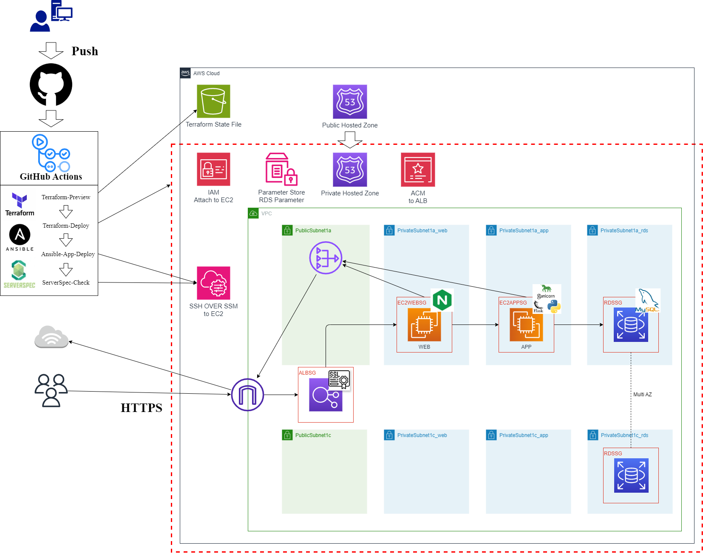

# AWSインフラ構築ポートフォリオ

## 概要
このリポジトリは、AWS上に**自作Flaskアプリケーション**の実行環境を構築する過程を、  
段階的にIaC（Infrastructure as Code）技術を活用しながら整理・自動化したものです。<br>

また、デプロイ対象となるアプリケーションは、自作した[flask-app](https://github.com/tomi050403/flask-app)（簡易画像データ管理システム）です。  

---

## 目的

- AWS環境のインフラ設計〜構築〜自動化プロセスを体系的に整理する
- インフラエンジニア/クラウドエンジニア志望としての実績可視化
- 再現性・保守性を重視したモジュール設計・運用管理を実践

---

## フェーズ構成

| No | フェーズ名                   | 内容                                   |
|----|-------------------------------|--------------------------------------|
| 01 | [Flaskアプリ手動構築](01-APP_Deploy.md) | VPC/EC2/RDS/ALB/Route53をCFnで構築し、手動でFlaskアプリ展開 |
| 02 | [Ansibleによるアプリ自動デプロイ](02-Ansible_APP_Deploy.md)   | 01で手動展開した内容についてAnsibleを用いてアプリデプロイ・サーバ設定を自動化           |
| 03 | [Terraformによる環境自動構築](03-Terraform_Deploy.md)       | 02までCFnで行っていた環境構築をTerraformにて自動化（モジュール化） |
| 04 | [GitHubActionsによるCICDパイプライン実装](04_CICD.md) | 環境構築（Terraform）、アプリデプロイ〜サーバテストまでをCI/CDパイプラインにて実装 |


---

## 構成イメージ（現時点）


---

## ディレクトリ構成

```bash
AWS_Portfolio/
├── 01_Flask_APP_Deploy/
├── 02_Ansible_APP_Deploy/
├── 03_Terraform_Deploy/
├── 04-CICD/
└── README.md（本ページ）
```

---

## 使用技術一覧

| 項目           | 内容                                    |
|----------------|----------------------------------------|
| クラウド        | AWS（VPC, EC2, RDS, ALB, Route53, IAM, SSM）|
| IaCツール      | CloudFormation, Ansible, Terraform    |
| 言語・ミドルウェア | Python3 (Flask), Gunicorn, Nginx       |
| 管理手法       | S3バックエンドによるtfstate管理        |
| セキュリティ管理 | SSM Parameter Store（SecureString）    |
| CI/CDツール     | GitHub Actions               |

---

## デプロイ対象アプリケーション

| 項目            | 内容                                       |
|----------------|-------------------------------------------|
| アプリ名         | [flask-app](https://github.com/tomi050403/flask-app) |
| 概要            | Flask製バックエンド＋MySQLを利用したCRUD可能な画像データ管理システム |
| 主要技術        | Python3.12以上, Flask3.0以上, MySQL8.0以上, Jinja2 |
| バージョン管理   | GitHub管理（Poetry利用による環境構築）   |

- アプリケーション自体は`flask run`で起動可能な設計
- 本ポートフォリオではGunicorn + Nginx構成にて本番運用を想定しデプロイ
- `.env` ファイルによるDB接続情報管理

---

## 今後の展望（予定）

- コンテナ化（ECS/Fargate）の検討